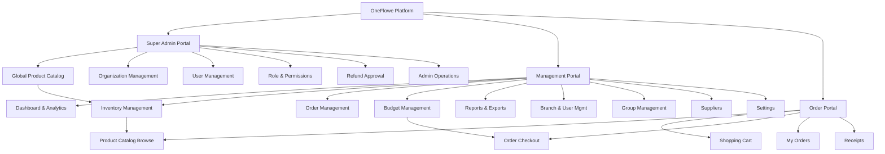
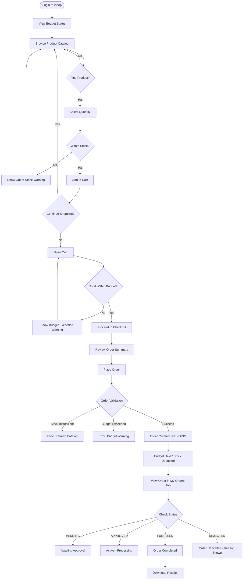
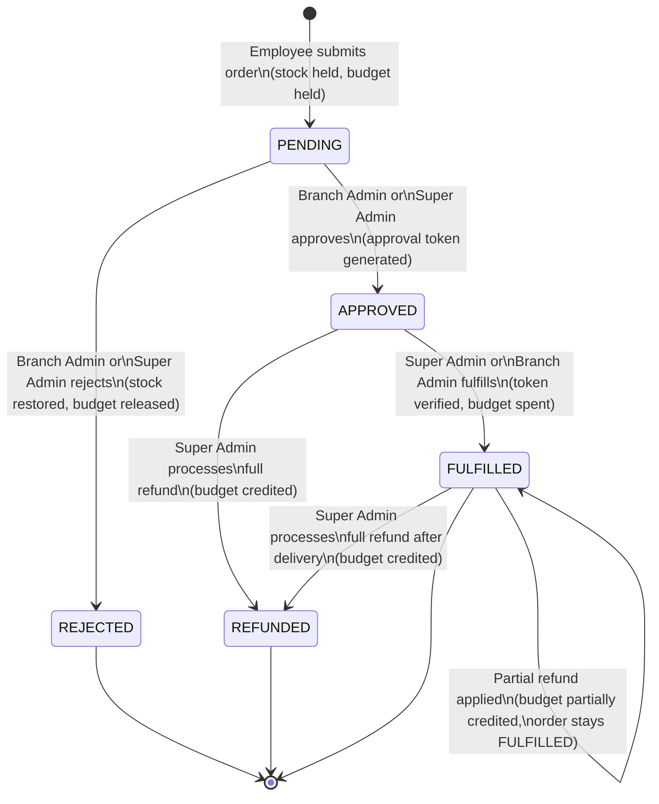
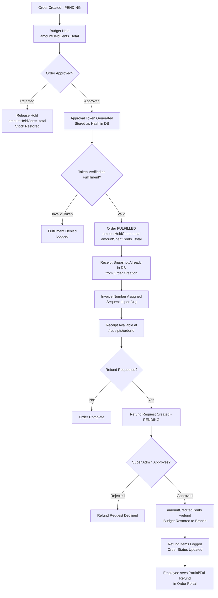
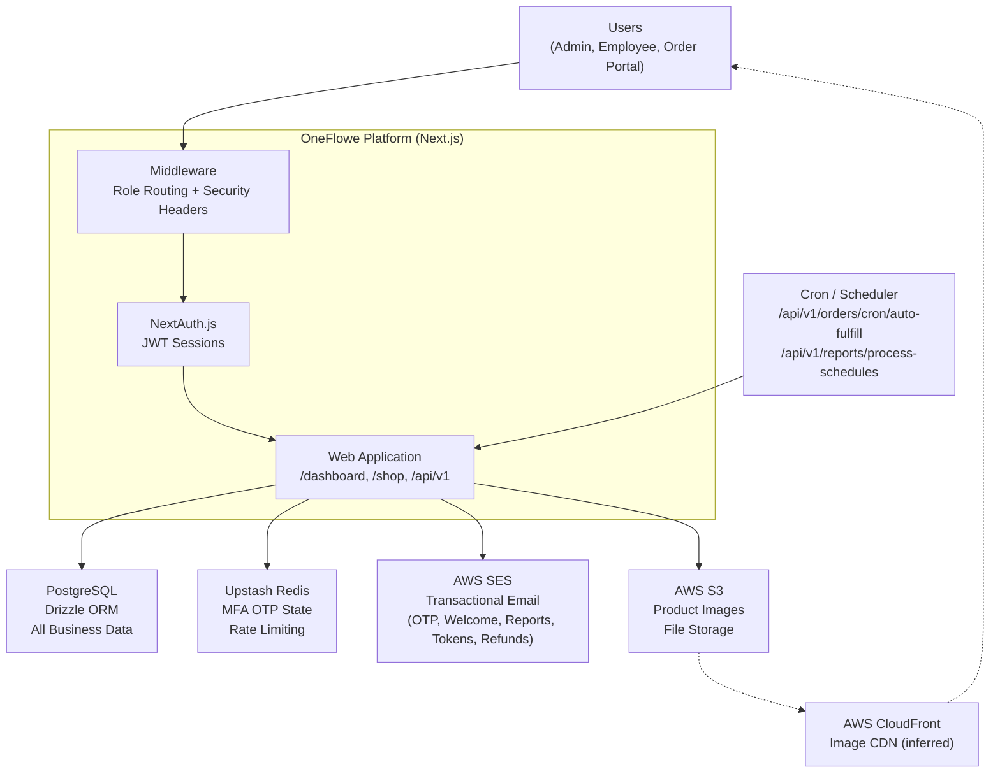

# Product Requirements Document (PRD)
## OneFlowe — Multi-Tenant Retail Operations Platform for Apricart

**Version:** 1.0  
**Date:** 2026-06-27  
**Platform:** Next.js 15 App Router (TypeScript)

---

## Table of Contents

1. [Product Overview](#1-product-overview)
2. [Product Goals](#2-product-goals)
3. [User Roles / Personas](#3-user-roles--personas)
4. [Main Features](#4-main-features)
5. [User Stories](#5-user-stories)
6. [Business Rules](#6-business-rules)
7. [Product Diagrams](#7-product-diagrams)
8. [Page / Route Map](#8-page--route-map)
9. [API / Server Action Map](#9-api--server-action-map)
10. [Data Entities Summary](#10-data-entities-summary)
11. [Non-Functional Requirements](#11-non-functional-requirements)
12. [Out of Scope](#12-out-of-scope)
13. [Open Questions](#13-open-questions)
14. [Improvement Suggestions](#14-improvement-suggestions)

---

## 1. Product Overview

**OneFlowe** is a multi-tenant internal procurement and operations platform built for **Apricart**, a retail chain. It enables employees across a three-level organizational hierarchy — **Super Admin → Organization (Head Office) → Branch** — to manage products, budgets, purchase orders, inventory, refunds, and reporting in a single platform.

The platform has three distinct portals:

- **Admin / Management Portal** (`/dashboard` and sub-pages): Used by Super Admins, Head Office managers, and Branch Admins to run day-to-day operations — managing inventory, users, budgets, orders, and reports.
- **Order Portal** (`/shop`): A simplified e-commerce-like interface used by **employees** (or ORDER_PORTAL role users) to browse available products assigned to their branch, add them to a cart, and submit purchase orders within their budget limits.
- **Receipts / Invoices** (`/receipts`, `/invoices`): Printable PDF documents generated per order, used for record-keeping and fulfillment verification.

The system enforces strict tenant isolation: each organization sees only its own branches, users, products, orders, and budgets. A **global product catalog** managed by Super Admin is cascaded down through organizations to branches.

---

## 2. Product Goals

1. **Streamline internal procurement** — Give branch employees a structured, budget-controlled way to request goods without using informal channels.
2. **Enforce budget discipline** — Automatically hold and spend budget as orders move through the approval lifecycle; prevent over-spend.
3. **Centralized inventory control** — Super Admin manages the master product catalog; Head Office and Branch Admin manage visibility and availability within their scope.
4. **Multi-level approval workflow** — Orders require approval before fulfillment; approval tokens are used to verify physical handover.
5. **Comprehensive analytics** — Provide organization, branch, and group-level reporting on orders, spending, products, and budgets.
6. **Compliance and auditability** — Maintain detailed audit logs, system logs, and receipt snapshots for every transaction.
7. **Security** — Bank-grade session validation, HSTS, CSP, MFA, role-based access control, and per-request permission checks.

---

## 3. User Roles / Personas

### 3.1 SUPER_ADMIN

| Attribute | Detail |
|---|---|
| Scope | Platform-wide |
| Access | All portals and features |
| Main pages | Dashboard, Organizations, Global Inventory, Users, Orders, Reports, Settings, Groups |

**What they can do:**
- Create, edit, and deactivate organizations and branches.
- Manage the global product catalog (create/edit/import products, assign product codes, manage discounts).
- Assign products to organizations; cascades down to branches automatically.
- Create and manage all users across all organizations.
- Approve, reject, fulfill, and refund any order in the system.
- Manage roles and granular permissions per role.
- View and export all reports across all organizations and branches.
- Process and approve refund requests submitted by branch admins.
- Run admin-level data repair and migration operations.

**Permissions:** Full system access (`system:full_access`). All permissions in all categories.

---

### 3.2 HEAD_OFFICE

| Attribute | Detail |
|---|---|
| Scope | Single organization |
| Access | Admin portal (`/dashboard` and sub-pages) |
| Main pages | Dashboard, Inventory, Orders, Budgets, Users, Branches, Reports, Groups, Settings |

**What they can do:**
- View and manage their organization's branches, users, and inventory.
- Enable or disable global products for their organization; override product names, descriptions, and prices.
- Assign products to branches.
- View and manage all orders within their organization.
- Approve or reject orders (depending on org-level permission config).
- Create and manage monthly budgets per branch; allocate add-on budgets.
- Create and manage branch groups for reporting.
- View organization-level and branch-level reports and export them.
- Configure organization settings (budget allocation mode, price visibility).

**Permission restrictions:** Cannot access `/organizations` (SUPER_ADMIN only). Cannot access `/shop`. Cannot process refunds (escalated to Super Admin). Branch management is limited to their own organization.

---

### 3.3 BRANCH_ADMIN

| Attribute | Detail |
|---|---|
| Scope | Single branch within an organization |
| Access | Admin portal (`/dashboard` and sub-pages) |
| Main pages | Dashboard, Inventory (branch), Orders, Budgets, Users, Reports |

**What they can do:**
- View and manage their branch's assigned inventory.
- Toggle product visibility and availability at the branch level.
- Request restocking from organization inventory.
- View and manage orders for their branch: approve, reject.
- View their branch's current budget for the active month.
- Create and manage employee credentials for the Order Portal.
- View branch-level reports.
- Submit refund requests on behalf of the branch (requires Super Admin approval).

**Permission restrictions:** Cannot see other branches' data. Cannot create or modify organizations. Cannot access Super Admin features.

---

### 3.4 ORDER_PORTAL (User)

| Attribute | Detail |
|---|---|
| Scope | Single branch |
| Access | Shop portal (`/shop`) only |
| Main pages | `/shop` |

**What they can do:**
- Log in to the Order Portal at `/shop`.
- Browse a catalog of products assigned and enabled for their branch.
- Add products to a shopping cart, respecting stock limits and quantity steps.
- View their branch's remaining budget for the current month.
- Submit a purchase order (budget is held on submission).
- View their own past orders and order status.
- View partial or full refund information on their own orders.
- Download receipts.

**Permission restrictions:** Strictly limited to `/shop`. Redirected away from all admin pages. Cannot see other users' orders. Cannot approve, reject, or fulfill orders. Prices may be hidden if org-level setting is enabled.

---

### 3.5 EMPLOYEE (Order Portal Employee)

| Attribute | Detail |
|---|---|
| Scope | Single branch |
| Access | Shop portal (`/shop`) |
| Managed by | Branch Admin (via Employee Credentials Manager) |

**What they can do:**
- Same as ORDER_PORTAL user. Employees are a distinct user type stored in the `employee_credentials` table (not the main `users` table).
- They log in using the `employee-credentials` NextAuth provider.
- MFA is optionally supported.

**Difference from ORDER_PORTAL:** Employees are branch-specific non-admin accounts. They use a separate credential table and are assigned a virtual role of `EMPLOYEE` in the JWT.

---

## 4. Main Features

### 4.1 Authentication

**Purpose:** Secure login with role-based session control.  
**Main Users:** All roles.  
**Pages/Routes:** `/login`, `/change-password`  
**API Routes:** `POST /api/auth/[...nextauth]`, `POST /api/v1/mfa/login/send-otp`, `POST /api/v1/mfa/login/verify-otp`, `POST /api/v1/users/me/change-password`

**Key Features:**
- Username/email + password login (case-insensitive).
- Optional 6-digit OTP MFA via email (2-minute expiry, Redis-backed).
- Separate login flows for admin users and employee credentials.
- 8-hour JWT sessions; session version tracking enables instant forced logout.
- On every session check: user active status, org status, branch status, and `sessionVersion` are validated against the database.
- `mustChangePassword` flag forces newly created users to set a new password before accessing any other page.
- Bank-grade security headers injected by middleware (HSTS, CSP, X-Frame-Options, etc.).

**Acceptance Criteria:**
- Admin users logging in with MFA enabled must complete OTP verification to access the system.
- Deactivating an organization or branch immediately terminates active sessions.
- A new user created with a temporary password must change it on first login.

---

### 4.2 Global Product Catalog Management

**Purpose:** Super Admin maintains a single master catalog of products shared across all organizations.  
**Main Users:** SUPER_ADMIN  
**Pages/Routes:** `/inventory` (global view), `/products/categories`, `/products/subcategories`  
**API Routes:** `GET/POST/PATCH/DELETE /api/v1/admin/global-inventory`, `GET /api/v1/admin/global-inventory/next-code`, `POST /api/v1/admin/global-inventory/import`

**Key Features:**
- Create, edit, activate/deactivate global products with: product code, name, category, description, unit, base price, image (via S3), stock quantity, decimal quantity support, and quantity step.
- Global discount configuration per product: percent or flat discount with optional start/end dates and active flag.
- CSV bulk import of products.
- Product code auto-generation.
- Soft-delete support (deleted products can be recreated with the same code).

**Acceptance Criteria:**
- A product deactivated at the global level should be hidden from all organization and branch inventories.
- Bulk import must report successful rows, failed rows, and validation errors.

---

### 4.3 Inventory Cascade (Organization and Branch Assignment)

**Purpose:** Control which products are visible at each level of the hierarchy.  
**Main Users:** SUPER_ADMIN (org-level assignment), HEAD_OFFICE (branch-level assignment)  
**Pages/Routes:** `/inventory/assigned` (org), `/inventory/branch`, `/inventory/branch/assign`, `/inventory/org`  
**API Routes:** `GET/POST /api/v1/inventory/organization-products`, `GET/POST /api/v1/inventory/branch-products`, `GET/POST/DELETE /api/v1/head-office/organization-inventory`, `GET /api/v1/head-office/branch-assignments`, `POST /api/v1/head-office/branch-assignments/toggle`

**Three-level cascade:**
1. **Global → Organization:** Super Admin assigns a global product to one or more organizations. This creates an `organizationInventory` record that can carry custom name, price, description, and image.
2. **Organization → Branch:** Head Office assigns organization-level inventory items to specific branches. This creates `branchInventory` records. Branch can toggle visibility and availability per product.
3. **Branch → Order Portal:** The Order Portal at `/shop` fetches only products assigned to the user's branch, that are visible and active.

**Product Assignment History:** Every assign/unassign action is logged to `productAssignments` table.

**Acceptance Criteria:**
- Removing a product from an organization must cascade-remove it from all branches.
- A branch admin can toggle product visibility without affecting other branches.

---

### 4.4 Branch Inventory Management

**Purpose:** Branch-level stock management including restock requests.  
**Main Users:** BRANCH_ADMIN, HEAD_OFFICE  
**Pages/Routes:** `/inventory/branch`, `/inventory/branch/status`, `/inventory/branch/hub`, `/inventory/branch/remove`, `/branch-inventory`  
**API Routes:** `GET/POST /api/v1/branch/inventory`, `POST /api/v1/inventory/branch-products/restock`

**Key Features:**
- View branch inventory with stock levels, visibility, and availability status.
- Adjust inventory quantities.
- Branch Admin can submit a restock request to Head Office when stock is low.
- Restock requests include: product, requested quantity, current stock, and reason.
- Restock requests move through: `pending → approved → rejected → fulfilled`.

---

### 4.5 Suppliers

**Purpose:** Track supplier relationships at branch level.  
**Main Users:** BRANCH_ADMIN  
**Pages/Routes:** `/inventory/suppliers`  
**API Routes:** `GET/POST /api/v1/suppliers`, `GET/PUT/DELETE /api/v1/suppliers/[id]`

**Key Features:** Create and manage supplier contact records per branch. Fields: name, address, contact person, email, description.

---

### 4.6 Categories and Subcategories

**Purpose:** Organize products into categories for browsing and filtering.  
**Main Users:** SUPER_ADMIN, HEAD_OFFICE (via Settings)  
**Pages/Routes:** `/products/categories`, `/products/subcategories`, `/settings`  
**API Routes:** `GET/POST /api/v1/categories`, `GET/POST /api/v1/subcategories`

**Key Features:** Hierarchical category structure (parent/child). Categories can be org-scoped.

---

### 4.7 Order Management (Admin)

**Purpose:** View, approve, reject, fulfill, and manage all orders from the admin portal.  
**Main Users:** BRANCH_ADMIN, HEAD_OFFICE, SUPER_ADMIN  
**Pages/Routes:** `/orders`, `/orders/[orderId]`  
**API Routes:** `GET/POST/PUT /api/v1/orders`, `POST /api/v1/orders/[id]/approve`, `POST /api/v1/orders/[id]/reject`, `POST /api/v1/orders/[id]/fulfill`, `GET /api/v1/orders/[id]/fulfillment-status`, `GET /api/v1/orders/[id]/send-token-email`

**Key Features:**
- List all orders filtered by status, branch, date range, group, or full-text search by TID.
- Role-scoped visibility: SUPER_ADMIN sees all orders; HEAD_OFFICE sees org-level orders; BRANCH_ADMIN sees their branch.
- **Approval flow:** Orders start as `PENDING` → BRANCH_ADMIN or HEAD_OFFICE approves → status becomes `APPROVED` and a one-time 10-character secure token is generated.
- **Fulfillment flow:** To fulfill an order (mark as `FULFILLED`), the fulfilling party must present the approval token. The token is hashed in the DB and validated at fulfillment time.
- **Token email:** An admin can email the fulfillment token directly from the order detail view.
- Order rejection includes a reason field. On rejection, budget hold is released and stock is restored.
- HEAD_OFFICE users have view-only order access (cannot approve or fulfill).
- Prices can be hidden per organization setting.

---

### 4.8 Order Portal (Employee Store)

**Purpose:** Employee-facing e-commerce interface for placing internal purchase orders.  
**Main Users:** ORDER_PORTAL, EMPLOYEE, and optionally BRANCH_ADMIN/HEAD_OFFICE/SUPER_ADMIN (for cross-branch testing)  
**Pages/Routes:** `/shop`  
**API Routes:** `POST /api/v1/orders` (order creation), `GET /api/v1/branch/inventory`, `GET /api/v1/budgets`

**Key Features:**
- Product catalog browsed by category (ribbon filter), with search by name or product code.
- Sorting: name A-Z, price low-high, price high-low, rating.
- Product cards show: image, name, product code, price/unit, stock badge, discount badge, quantity step controls, and Add to Cart button.
- Cart drawer with per-item quantity adjustments, line totals, budget remaining indicator, and budget exceeded warning.
- Checkout modal: order summary and Place Order button.
- Budget enforcement: order total must not exceed `(allocated + credited) - (spent + held)`. Enforced both client-side and server-side inside a DB transaction with `SELECT FOR UPDATE` lock.
- Quantity budget mode: when an org uses quantity-based budgets, ORDER_PORTAL users see a "remaining" badge per product and orders validate against per-product quantity limits.
- Stock enforcement: stock is deducted immediately on order creation (inside the same transaction).
- My Orders tab: list of the user's own orders with status, timeline, and receipt download.
- Refunded tab: orders with partial or full refunds.
- Prices can be hidden (controlled by org setting).
- Auto-refresh every 5 seconds when viewing orders or order details.

---

### 4.9 Budget Management

**Purpose:** Allocate monthly budgets to branches; track spend and refund credits.  
**Main Users:** HEAD_OFFICE (allocate), BRANCH_ADMIN (view), SUPER_ADMIN (view all)  
**Pages/Routes:** `/budgets`, `/budget-by-quantity`  
**API Routes:** `GET/POST/PUT /api/v1/budgets`, `GET/POST /api/v1/budget-quantity`

**Two budget allocation modes (configurable per organization):**

1. **Amount mode (default):** Each branch gets a monetary budget per month (in PKR, stored as cents). Fields: `amountAllocatedCents`, `amountHeldCents`, `amountSpentCents`, `amountCreditedCents`.
2. **Quantity mode:** Each product within the org inventory gets a per-branch quantity budget per month. Tracked in `productQuantityBudgets` with: `allocatedQuantity`, `heldQuantity`, `usedQuantity`, `creditedQuantity`.

**Budget lifecycle:**
- On order creation: `amountHeldCents` increases; stock decreases.
- On order approval: token generated (no budget change at approval).
- On order fulfillment: `amountHeldCents` decreases; `amountSpentCents` increases.
- On order rejection/cancellation: `amountHeldCents` decreases; stock restored.
- On refund approval: `amountCreditedCents` increases (returns budget to branch).

**Add-on budgets:** Head Office can add supplemental budget to a branch mid-month with a reason (stored in `budgetAddons`).

**Baseline budget:** Each branch has a `baselineBudgetCents` that is auto-used to initialize the budget record if none exists for the current month.

---

### 4.10 Refunds

**Purpose:** Partially or fully refund fulfilled or approved orders.  
**Main Users:** BRANCH_ADMIN (request), SUPER_ADMIN (approve/process)  
**Pages/Routes:** `/refunds`  
**API Routes:** `GET/POST /api/v1/orders/[id]/refunds`, `GET/PATCH/DELETE /api/v1/admin/refunds`, `GET/PATCH /api/v1/admin/refunds/[id]`

**Key Features:**
- Branch Admin can submit a refund request for specific items and quantities on an approved or fulfilled order.
- Refund request starts as `PENDING`; Super Admin reviews and approves.
- On approval: `amountCreditedCents` is added back to the branch budget for the order's creation month.
- Refund notifications are sent via email to Super Admin.
- Refund items are tracked line-by-line in `refundItems` table.
- The Order Portal shows a "Refunded" tab with full/partial refund state per order.

---

### 4.11 Receipts and Invoices

**Purpose:** Generate printable receipts and invoices for each order.  
**Main Users:** All roles (download), ORDER_PORTAL (view receipt for own orders)  
**Pages/Routes:** `/receipts/[orderId]`, `/invoices/[orderId]`  
**API Routes:** `GET /api/v1/receipts/[orderId]`, `GET /api/v1/receipts/[orderId]/download`

**Key Features:**
- Receipt data is captured as a JSON snapshot (`receiptData` on the order) at the time of order creation, ensuring historical accuracy even if product prices change later.
- Each receipt includes: invoice number, date, buyer name and address, organization name, itemized line items (by category), subtotal, tax, delivery charges, discount, refund amount, and total.
- Invoice numbers are sequential per organization (from `invoiceSequences` table).
- Receipts are rendered as printable HTML pages and downloadable PDFs.
- jsPDF is used for PDF generation.

---

### 4.12 Reports and Analytics

**Purpose:** Provide data-driven insights into orders, spending, products, branches, and budgets.  
**Main Users:** SUPER_ADMIN (all-org), HEAD_OFFICE (org-level), BRANCH_ADMIN (branch-level)  
**Pages/Routes:** `/reports`, `/reports/branch-reports`, `/reports/organization-report`, `/reports/budget-summary`, `/reports/order-report`, `/reports/product-performance`, `/reports/user-report`, `/reports/groups`, `/reports/groups/[id]`  
**API Routes:** Multiple under `/api/v1/analytics/`

**Report types available:**
- Dashboard KPIs: total orders, total spend, order counts by status.
- Monthly sales chart.
- Weekly sales chart.
- Yearly sales chart.
- Product performance: top/bottom products by quantity and revenue.
- Product catalog performance.
- Branch performance comparison.
- Organization-level stats.
- Budget summary by branch and period.
- Order report with itemized drill-down.
- User performance report.
- Group-level analytics (collections of branches).
- Lifetime stats.

**Export:** Reports can be exported to CSV or Excel (xlsx). PDF export via jsPDF.

**Scheduled reports:** Users can configure automated reports (daily/weekly/monthly) sent to email recipients as CSV attachments via AWS SES.

---

### 4.13 Groups (Branch Grouping)

**Purpose:** Group branches together for aggregated reporting and analytics.  
**Main Users:** HEAD_OFFICE, SUPER_ADMIN  
**Pages/Routes:** `/groups`, `/groups/analytics`  
**API Routes:** `GET/POST /api/v1/groups`, `GET/PUT/DELETE /api/v1/groups/[id]`, `GET /api/v1/groups/[id]/branches`, `GET /api/v1/groups/[id]/branch-counts`, `POST /api/v1/groups/[id]/branches/clean`, `GET /api/v1/reports/groups/[id]/performance`

**Key Features:**
- Create named groups and assign branches to them.
- View aggregated analytics across all branches in a group.
- Groups have a soft-delete: deleted groups can be recreated with the same name.
- Group access is audit-logged.

---

### 4.14 User Management

**Purpose:** Create, update, and deactivate admin and portal users.  
**Main Users:** SUPER_ADMIN (all), HEAD_OFFICE (org-scoped)  
**Pages/Routes:** `/users`, `/employee-management`  
**API Routes:** `GET/POST /api/v1/users`, `GET/PUT/DELETE /api/v1/users/[id]`, `GET /api/v1/users/check-username`, `GET/POST /api/v1/employee-credentials`

**Key Features:**
- Create users with role assignment (SUPER_ADMIN, HEAD_OFFICE, BRANCH_ADMIN, ORDER_PORTAL).
- Welcome email sent automatically on creation with temporary password.
- `mustChangePassword` flag forces first-login password change.
- Soft-delete: users have a `deletedAt` timestamp; their data is preserved.
- `sessionVersion` incremented on password change or manual session invalidation — instantly kicks the user out.
- MFA enable/disable per user.
- Employee credentials (for `/shop`) managed separately per branch by BRANCH_ADMIN.

---

### 4.15 Organization and Branch Management

**Purpose:** SUPER_ADMIN manages the multi-tenant hierarchy.  
**Main Users:** SUPER_ADMIN  
**Pages/Routes:** `/organizations`, `/branches`  
**API Routes:** `GET/POST /api/v1/organizations`, `GET/PUT/DELETE /api/v1/organizations/[id]`, `GET/POST /api/v1/branches`, `GET/PUT/DELETE /api/v1/branches/[id]`

**Key Features:**
- Create and manage organizations with name, code, status, and logo.
- Create and manage branches: name, province, city, address, admin user, group assignment, baseline budget.
- Deactivating an org or branch immediately invalidates all user sessions for that scope.
- Organization settings: configurable key-value store (e.g., budget mode, price visibility).

---

### 4.16 Notifications

**Purpose:** In-app notification delivery.  
**Main Users:** All roles  
**API Routes:** `GET/POST /api/v1/notifications`

**Key Features:**
- Notifications stored in `notifications` table with type, message, target role, and read timestamp.
- Scoped to user, organization, and branch.

---

### 4.17 MFA (Multi-Factor Authentication)

**Purpose:** Optional second factor for login.  
**Main Users:** All users (admin and employees)  
**API Routes:** `GET /api/v1/mfa/status`, `POST /api/v1/mfa/toggle`, `POST /api/v1/mfa/send-otp`, `POST /api/v1/mfa/verify-otp`, `POST /api/v1/mfa/login/send-otp`, `POST /api/v1/mfa/login/verify-otp`

**Key Features:**
- OTP sent via email (AWS SES), expires in 2 minutes.
- Rate limiting and daily count limits to prevent OTP abuse.
- Cooldown enforced between OTP requests.
- Redis (Upstash) used to store OTP state.

---

### 4.18 Roles and Permissions

**Purpose:** Fine-grained access control per role.  
**Main Users:** SUPER_ADMIN  
**Pages/Routes:** `/settings` (role permissions manager)  
**API Routes:** `GET/POST /api/v1/roles`, `GET/PUT /api/v1/roles/permissions`

**Permission categories (from `lib/permissions.ts`):**
- System Administration
- Organization Management
- User Management
- Inventory Management
- Order Management
- Financial Operations
- Reports & Analytics
- Settings & Configuration
- Group Management

**Predefined role templates:** SUPER_ADMIN (all permissions), HEAD_OFFICE (org-scoped), BRANCH_ADMIN (branch-scoped), ORDER_PORTAL (create/view orders only).

---

### 4.19 Modifiers

**Purpose:** Product variant metadata (unit, size, packaging type).  
**Main Users:** SUPER_ADMIN  
**API Routes:** `GET/POST /api/v1/modifiers`

**Key Features:** Modifiers are tagged to global products via `productModifiers` junction table. Each modifier has a type (unit, size, packaging), status, and sort order.

---

### 4.20 System Health

**Purpose:** Verify system connectivity.  
**API Routes:** `GET /api/v1/health`

---

## 5. User Stories

### Authentication

- As any user, I want to log in with my username/email and password, so that I can access the system.
- As any user with MFA enabled, I want to receive a one-time code via email and enter it after my password, so that my account is protected by two factors.
- As a newly created user, I want to be forced to change my temporary password on first login, so that my account is secure from the start.
- As a user, I want my session to be automatically invalidated if my account is deactivated or my password is changed, so that unauthorized access is prevented immediately.

### Order Portal (Employee / ORDER_PORTAL)

- As an employee, I want to browse available products for my branch filtered by category, so that I can find what I need quickly.
- As an employee, I want to add products to a cart with the correct quantity, so that I can bundle my procurement request.
- As an employee, I want to see my remaining monthly budget while shopping, so that I know how much I can spend.
- As an employee, I want to be prevented from submitting an order that exceeds my budget, so that I don't accidentally overspend.
- As an employee, I want to place an order that gets submitted for approval, so that my branch admin can review it.
- As an employee, I want to view my past orders and their status, so that I can track whether my requests were approved or fulfilled.
- As an employee, I want to download a receipt for a fulfilled order, so that I have a record for reconciliation.

### Order Management (Admin)

- As a Branch Admin, I want to view all pending orders for my branch, so that I can approve or reject them promptly.
- As a Branch Admin, I want to approve a pending order and receive a secure fulfillment token, so that physical fulfillment can be verified.
- As a Branch Admin, I want to reject an order with a reason, so that the employee understands why their request was declined.
- As a Super Admin, I want to fulfill an order by entering its approval token, so that I can verify the physical handover.
- As a Branch Admin, I want to email the fulfillment token to myself or a colleague, so that the token isn't lost.

### Budget Management

- As a Head Office user, I want to allocate a monthly budget to each branch, so that spending is controlled.
- As a Head Office user, I want to add supplemental budget to a branch with a reason, so that exceptional needs can be accommodated.
- As a Branch Admin, I want to view my branch's current budget status (allocated, held, spent, remaining), so that I can advise employees on spending limits.
- As a Super Admin, I want to view budget summaries across all organizations and branches, so that I can monitor overall spend.

### Inventory Management

- As a Super Admin, I want to add a new product to the global catalog, so that it can be assigned to organizations.
- As a Super Admin, I want to import products in bulk via CSV, so that initial setup is fast.
- As a Head Office user, I want to assign a global product to my organization with a custom price, so that our branches see our contracted pricing.
- As a Head Office user, I want to assign org-level products to specific branches, so that each branch only sees what they need.
- As a Branch Admin, I want to toggle a product's visibility on/off for my branch, so that out-of-season or unavailable items don't appear in the Order Portal.

### Refunds

- As a Branch Admin, I want to submit a refund request for items on a fulfilled order, so that the branch budget can be credited back.
- As a Super Admin, I want to review and approve pending refund requests, so that budget credits are properly authorized.
- As an employee, I want to see refund status on my orders, so that I know if a credit was applied.

### Reports

- As a Head Office user, I want to view monthly sales and spending trends for my organization, so that I can identify patterns.
- As a Head Office user, I want to view performance analytics for a group of branches, so that I can compare them.
- As a Head Office user, I want to schedule a weekly report sent to my email, so that I receive updates automatically.
- As a Super Admin, I want to export any report to CSV or Excel, so that I can share data with stakeholders.

### User Management

- As a Super Admin, I want to create a new user and have a welcome email sent automatically, so that onboarding is streamlined.
- As a Branch Admin, I want to create employee credentials for the Order Portal, so that my staff can log in to place orders.

---

## 6. Business Rules

### Orders

1. An order can only be created if the branch has an active budget for the current month AND the order total does not exceed the remaining budget (`allocated + credited - spent - held`). **Confirmed.**
2. On order creation, the order total is placed on "hold" (`amountHeldCents` increments). Stock is immediately decremented from `globalProducts.stockQuantity`. **Confirmed.**
3. Orders can only be approved when in `PENDING` status. **Confirmed.**
4. On approval, a 10-character secure approval token is generated. The plaintext token is shown once and optionally emailed; only the hash is stored. **Confirmed.**
5. To fulfill an order, the exact approval token must be presented and verified against the stored hash. **Confirmed.**
6. On fulfillment: `amountHeldCents` decreases, `amountSpentCents` increases by the order total. **Confirmed.**
7. On rejection or cancellation: `amountHeldCents` decreases, stock is restored. **Confirmed.**
8. Terminal order statuses (`CANCELLED`, `FULFILLED`, `REFUNDED`, `REJECTED`) cannot be transitioned to any other status. **Confirmed.**
9. HEAD_OFFICE users have view-only order access; they cannot approve or fulfill orders via the API. **Confirmed.**
10. ORDER_PORTAL users can only view their own orders, restricted to their organization and branch. **Confirmed.**
11. The order fulfillment month (for budget updates) is always the month the order was **created**, not today's month. This ensures cross-month fulfillments update the correct budget period. **Confirmed.**

### Budget

12. A budget record is auto-initialized from the branch's `baselineBudgetCents` if no record exists for the current month when an order is placed. **Confirmed.**
13. Budget holds must be verified inside a DB transaction with `SELECT FOR UPDATE` to prevent race conditions. **Confirmed.**
14. The budget allocation mode (`amount` vs `quantity`) is configurable per organization. In `quantity` mode, each product also has a quantity budget. **Confirmed.**
15. Refund approval credits the refund amount back to the branch budget as `amountCreditedCents` for the order's original creation month. **Confirmed** (inferred from budget update logic).

### Stock

16. Stock is decremented at order creation, not at fulfillment. This ensures no over-selling between creation and fulfillment. **Confirmed.**
17. Stock is restored on order rejection or cancellation. **Confirmed.**
18. Stock validation inside the transaction is the single source of truth (`SELECT FOR UPDATE` on `globalProducts`). **Confirmed.**

### Pricing

19. Price used for an order is determined by: `organizationInventory.customPrice` if set, otherwise `globalProducts.basePrice`. **Confirmed.**
20. Prices can be hidden from ORDER_PORTAL users if `pricesHidden` is enabled at the organization level. When hidden, totals and prices are nulled in API responses. **Confirmed.**
21. Products can have a time-bound discount (percent or flat amount), configured at the global product level. The discounted price is shown in the Order Portal. **Inferred** (discount fields visible in schema and shop UI, but no discount-calculation server-side code was directly inspected for order total).

### Inventory

22. A product can only be visible in the Order Portal if it is assigned at all three levels: global → organization → branch, and all levels are active/enabled/visible. **Confirmed.**
23. Removing a product at the organization level cascades to `branchInventory` (via `ON DELETE CASCADE`). **Confirmed.**

### Refunds

24. A refund request starts as `PENDING` and must be approved by a Super Admin before budget is credited. **Confirmed.**
25. Refunds are line-item-aware: each refund tracks the specific order items and quantities being refunded. **Confirmed.**

### Sessions and Security

26. Every session callback validates `sessionVersion` against the DB. Changing a user's password increments `sessionVersion`, immediately invalidating all existing sessions. **Confirmed.**
27. `mustChangePassword = true` blocks access to all pages except `/change-password`. **Confirmed** (enforced in middleware).

---

## 7. Product Diagrams

### 7.1 Product Module Diagram

---

### 7.2 User Role Flow Diagram

```mermaid
graph TD
    Login["/login"] --> SA{Role?}

    SA -->|SUPER_ADMIN| SAP[Super Admin Portal]
    SA -->|HEAD_OFFICE| HOP[Head Office Portal]
    SA -->|BRANCH_ADMIN| BAP[Branch Admin Portal]
    SA -->|ORDER_PORTAL| OP[Order Portal /shop]
    SA -->|EMPLOYEE| OP

    SAP --> SAP1[Organizations]
    SAP --> SAP2[Global Inventory]
    SAP --> SAP3[All Users]
    SAP --> SAP4[All Orders - Approve/Fulfill]
    SAP --> SAP5[All Budgets]
    SAP --> SAP6[Refunds - Approve]
    SAP --> SAP7[All Reports]
    SAP --> SAP8[Roles & Permissions]

    HOP --> HOP1[Org Inventory - Assign]
    HOP --> HOP2[Branch Management]
    HOP --> HOP3[Org Users]
    HOP --> HOP4[Orders - View Only]
    HOP --> HOP5[Budgets - Allocate]
    HOP --> HOP6[Groups]
    HOP --> HOP7[Org Reports]

    BAP --> BAP1[Branch Inventory]
    BAP --> BAP2[Orders - Approve/Reject]
    BAP --> BAP3[Branch Budget - View]
    BAP --> BAP4[Employee Credentials]
    BAP --> BAP5[Refund Requests]
    BAP --> BAP6[Branch Reports]
    BAP --> BAP7[Suppliers]

    OP --> OP1[Browse Products]
    OP --> OP2[Cart & Checkout]
    OP --> OP3[My Orders]
    OP --> OP4[Receipts]
```

---

### 7.3 Customer Order Journey (Employee / ORDER_PORTAL)

---

### 7.4 Admin Management Flow

```mermaid
flowchart TD
    A([Admin Login]) --> B{Admin Role}

    B -->|SUPER_ADMIN| SA[Super Admin Dashboard]
    B -->|HEAD_OFFICE| HO[Head Office Dashboard]
    B -->|BRANCH_ADMIN| BA[Branch Admin Dashboard]

    SA --> SA1[Manage Organizations]
    SA --> SA2[Manage Global Products]
    SA --> SA3[Assign Products to Orgs]
    SA --> SA4[Manage All Users]
    SA --> SA5[Review Refund Requests]
    SA --> SA6[Fulfill Orders with Token]
    SA --> SA7[View Platform-wide Reports]

    HO --> HO1[Assign Org Products to Branches]
    HO --> HO2[Manage Branches]
    HO --> HO3[Manage Org Users]
    HO --> HO4[Allocate Monthly Budgets]
    HO --> HO5[Create Branch Groups]
    HO --> HO6[View Org-level Reports]
    HO --> HO7[Schedule Automated Reports]

    BA --> BA1[Manage Branch Inventory Visibility]
    BA --> BA2[Approve / Reject Orders]
    BA --> BA3[View Branch Budget]
    BA --> BA4[Manage Employee Credentials]
    BA --> BA5[Submit Refund Requests]
    BA --> BA6[Manage Suppliers]
    BA --> BA7[View Branch Reports]
```

---

### 7.5 Order Lifecycle Diagram

---

### 7.6 Payment / Invoice / Receipt Flow

---

### 7.7 System Context Diagram

---

## 8. Page / Route Map

| Route | Purpose | Main Role | Related Feature |
|---|---|---|---|
| `/login` | Login page (admin users and employees) | All | Authentication |
| `/change-password` | Forced password change on first login | All (new users) | Authentication |
| `/dashboard` | KPI overview, orders summary, spend metrics | All admin roles | Analytics |
| `/organizations` | List/create/edit organizations | SUPER_ADMIN | Org Management |
| `/branches` | List/create/edit branches for org | HEAD_OFFICE | Branch Management |
| `/users` | List/create/edit admin users | SUPER_ADMIN, HEAD_OFFICE | User Management |
| `/employee-management` | Create/manage employee portal credentials | BRANCH_ADMIN | Employee Credentials |
| `/inventory` | Global inventory overview | SUPER_ADMIN | Global Catalog |
| `/inventory/add` | Add new global product | SUPER_ADMIN | Global Catalog |
| `/inventory/adjust` | Adjust stock quantities | SUPER_ADMIN, BRANCH_ADMIN | Inventory |
| `/inventory/assign` | Assign global products to org | SUPER_ADMIN | Inventory Cascade |
| `/inventory/assigned` | View org-level assigned products | HEAD_OFFICE | Inventory Cascade |
| `/inventory/org` | Org-level inventory management | HEAD_OFFICE | Inventory Cascade |
| `/inventory/branch` | Branch-level inventory | HEAD_OFFICE, BRANCH_ADMIN | Inventory Cascade |
| `/inventory/branch/assign` | Assign org products to branch | HEAD_OFFICE | Inventory Cascade |
| `/inventory/branch/hub` | Branch inventory hub overview | BRANCH_ADMIN | Inventory |
| `/inventory/branch/remove` | Remove products from branch | HEAD_OFFICE | Inventory Cascade |
| `/inventory/branch/status` | Toggle branch product status | BRANCH_ADMIN | Inventory |
| `/inventory/branch/org-products` | View org products for branch context | HEAD_OFFICE | Inventory |
| `/inventory/suppliers` | Manage suppliers | BRANCH_ADMIN | Suppliers |
| `/inventory/warehouse` | Warehouse view | SUPER_ADMIN | Inventory |
| `/products/categories` | Manage product categories | SUPER_ADMIN, HEAD_OFFICE | Categories |
| `/products/subcategories` | Manage subcategories | SUPER_ADMIN, HEAD_OFFICE | Categories |
| `/orders` | List and manage all orders | Admin roles | Order Management |
| `/orders/[orderId]` | Order detail: approve, reject, fulfill, token | Admin roles | Order Management |
| `/budgets` | Branch budget management | HEAD_OFFICE, BRANCH_ADMIN | Budget Management |
| `/budget-by-quantity` | Quantity-based budget management | HEAD_OFFICE, BRANCH_ADMIN | Budget Management |
| `/branch-inventory` | Branch inventory summary | BRANCH_ADMIN | Inventory |
| `/refunds` | Refund request management | BRANCH_ADMIN, SUPER_ADMIN | Refunds |
| `/groups` | Branch group management | HEAD_OFFICE, SUPER_ADMIN | Groups |
| `/groups/analytics` | Group performance analytics | HEAD_OFFICE, SUPER_ADMIN | Analytics |
| `/reports` | Main reports dashboard | Admin roles | Reports |
| `/reports/branch-reports` | Branch-level reports | HEAD_OFFICE, BRANCH_ADMIN | Reports |
| `/reports/organization-report` | Organization-level report | HEAD_OFFICE, SUPER_ADMIN | Reports |
| `/reports/budget-summary` | Budget summary report | HEAD_OFFICE, SUPER_ADMIN | Reports |
| `/reports/order-report` | Detailed order report | Admin roles | Reports |
| `/reports/product-performance` | Product analytics | Admin roles | Reports |
| `/reports/user-report` | User performance analytics | Admin roles | Reports |
| `/reports/groups` | Group-level reports | HEAD_OFFICE, SUPER_ADMIN | Reports |
| `/reports/groups/[id]` | Individual group performance | HEAD_OFFICE, SUPER_ADMIN | Reports |
| `/settings` | Org settings, role permissions, categories | Admin roles | Settings |
| `/shop` | Employee Order Portal | ORDER_PORTAL, EMPLOYEE | Order Portal |
| `/receipts/[orderId]` | Printable receipt page | All roles | Receipts |
| `/invoices/[orderId]` | Invoice/receipt PDF page | Admin roles | Invoices |

---

## 9. API / Server Action Map

| API / Action | Purpose | Used By | Related Module |
|---|---|---|---|
| `POST /api/auth/[...nextauth]` | NextAuth session login (4 providers) | All | Authentication |
| `POST /api/v1/mfa/login/send-otp` | Send login OTP | All (MFA enabled) | Authentication |
| `POST /api/v1/mfa/login/verify-otp` | Verify login OTP | All (MFA enabled) | Authentication |
| `GET/PUT /api/v1/mfa/status` | Get/toggle user MFA setting | All | MFA |
| `POST /api/v1/mfa/send-otp` | Send OTP for settings change | All | MFA |
| `POST /api/v1/mfa/verify-otp` | Verify settings OTP | All | MFA |
| `POST /api/v1/users/me/change-password` | Change own password | All | Authentication |
| `GET/POST /api/v1/users` | List/create admin users | SUPER_ADMIN, HEAD_OFFICE | User Management |
| `GET/PUT/DELETE /api/v1/users/[id]` | Read/update/delete user | SUPER_ADMIN, HEAD_OFFICE | User Management |
| `GET /api/v1/users/check-username` | Check username availability | SUPER_ADMIN, HEAD_OFFICE | User Management |
| `GET/POST /api/v1/employee-credentials` | Manage employee portal accounts | BRANCH_ADMIN | Employee Credentials |
| `GET/POST /api/v1/organizations` | List/create organizations | SUPER_ADMIN | Org Management |
| `GET/PUT/DELETE /api/v1/organizations/[id]` | Org detail, update, delete | SUPER_ADMIN | Org Management |
| `GET/POST /api/v1/branches` | List/create branches | SUPER_ADMIN, HEAD_OFFICE | Branch Management |
| `GET/PUT/DELETE /api/v1/branches/[id]` | Branch detail, update, delete | SUPER_ADMIN, HEAD_OFFICE | Branch Management |
| `GET/POST /api/v1/admin/global-inventory` | Manage global product catalog | SUPER_ADMIN | Global Catalog |
| `GET/PUT/DELETE /api/v1/inventory/global-products/[id]` | Single global product ops | SUPER_ADMIN | Global Catalog |
| `POST /api/v1/admin/global-inventory/import` | Bulk CSV import products | SUPER_ADMIN | Global Catalog |
| `GET /api/v1/admin/global-inventory/next-code` | Get next available product code | SUPER_ADMIN | Global Catalog |
| `GET/POST /api/v1/inventory/organization-products` | Org-level product assignments | SUPER_ADMIN, HEAD_OFFICE | Inventory Cascade |
| `GET/POST /api/v1/inventory/branch-products` | Branch-level product assignments | HEAD_OFFICE, BRANCH_ADMIN | Inventory Cascade |
| `POST /api/v1/inventory/branch-products/restock` | Request restock for branch product | BRANCH_ADMIN | Inventory |
| `GET/POST /api/v1/head-office/organization-inventory` | HO org inventory management | HEAD_OFFICE | Inventory Cascade |
| `GET /api/v1/head-office/branch-assignments` | View branch product assignments | HEAD_OFFICE | Inventory Cascade |
| `POST /api/v1/head-office/branch-assignments/toggle` | Toggle branch product visibility | HEAD_OFFICE | Inventory Cascade |
| `GET /api/v1/branch/inventory` | Branch inventory (Order Portal) | All (shop) | Order Portal |
| `GET/POST /api/v1/orders` | List all orders / Create order | All | Orders |
| `PUT /api/v1/orders` | Approve/reject/fulfill/cancel order | SUPER_ADMIN, BRANCH_ADMIN | Orders |
| `GET/PUT/DELETE /api/v1/orders/[id]` | Single order detail/update | Admin roles | Orders |
| `POST /api/v1/orders/[id]/approve` | Approve order | BRANCH_ADMIN, SUPER_ADMIN | Orders |
| `POST /api/v1/orders/[id]/reject` | Reject order | BRANCH_ADMIN, SUPER_ADMIN | Orders |
| `POST /api/v1/orders/[id]/fulfill` | Fulfill order with token | SUPER_ADMIN, BRANCH_ADMIN | Orders |
| `GET /api/v1/orders/[id]/fulfillment-status` | Get fulfillment status | Admin roles | Orders |
| `POST /api/v1/orders/[id]/send-token-email` | Email fulfillment token | Admin roles | Orders |
| `POST /api/v1/orders/cron/auto-fulfill` | Cron: auto-fulfill approved orders | System/Cron | Orders |
| `GET/POST/PUT /api/v1/budgets` | Budget management | HEAD_OFFICE, BRANCH_ADMIN | Budget Management |
| `GET/POST /api/v1/budget-quantity` | Quantity budget management | HEAD_OFFICE | Budget Management |
| `GET/POST /api/v1/orders/[id]/refunds` | Request refund for order | BRANCH_ADMIN | Refunds |
| `GET/PATCH /api/v1/admin/refunds` | List/process refund requests | SUPER_ADMIN | Refunds |
| `GET/PATCH/DELETE /api/v1/admin/refunds/[id]` | Single refund management | SUPER_ADMIN | Refunds |
| `GET /api/v1/receipts/[orderId]` | Get receipt data | All | Receipts |
| `GET /api/v1/receipts/[orderId]/download` | Download receipt PDF | All | Receipts |
| `GET/POST /api/v1/categories` | Category management | SUPER_ADMIN, HEAD_OFFICE | Categories |
| `GET/POST /api/v1/subcategories` | Subcategory management | SUPER_ADMIN, HEAD_OFFICE | Categories |
| `GET/POST /api/v1/suppliers` | Supplier management | BRANCH_ADMIN | Suppliers |
| `GET/PUT/DELETE /api/v1/suppliers/[id]` | Single supplier ops | BRANCH_ADMIN | Suppliers |
| `GET/POST /api/v1/groups` | Branch group management | HEAD_OFFICE, SUPER_ADMIN | Groups |
| `GET/PUT/DELETE /api/v1/groups/[id]` | Single group ops | HEAD_OFFICE, SUPER_ADMIN | Groups |
| `GET /api/v1/groups/[id]/branches` | Branches in group | HEAD_OFFICE, SUPER_ADMIN | Groups |
| `GET/POST /api/v1/roles` | Role management | SUPER_ADMIN | Roles |
| `GET/PUT /api/v1/roles/permissions` | Permission management | SUPER_ADMIN | Permissions |
| `GET/POST /api/v1/settings` | Organization settings CRUD | Admin roles | Settings |
| `GET/POST /api/v1/modifiers` | Product modifier management | SUPER_ADMIN | Products |
| `GET/POST /api/v1/notifications` | Notification management | All | Notifications |
| `GET /api/v1/analytics/dashboard` | Dashboard KPIs | Admin roles | Analytics |
| `GET /api/v1/analytics/monthly-sales` | Monthly sales data | Admin roles | Analytics |
| `GET /api/v1/analytics/weekly-sales` | Weekly sales data | Admin roles | Analytics |
| `GET /api/v1/analytics/yearly-sales` | Yearly sales data | Admin roles | Analytics |
| `GET /api/v1/analytics/summary` | Analytics summary | Admin roles | Analytics |
| `GET /api/v1/analytics/lifetime-stats` | Lifetime platform stats | SUPER_ADMIN | Analytics |
| `GET /api/v1/analytics/products/performance` | Product performance | Admin roles | Analytics |
| `GET /api/v1/analytics/products/catalog-performance` | Catalog analytics | Admin roles | Analytics |
| `GET /api/v1/analytics/branches/performance` | Branch comparison | HEAD_OFFICE, SUPER_ADMIN | Analytics |
| `GET /api/v1/analytics/budgets/summary` | Budget analytics | Admin roles | Analytics |
| `GET /api/v1/analytics/orders/itemized` | Itemized order analytics | Admin roles | Analytics |
| `GET /api/v1/analytics/refunds` | Refund analytics | Admin roles | Analytics |
| `GET /api/v1/analytics/groups` | Group analytics | HEAD_OFFICE, SUPER_ADMIN | Analytics |
| `GET /api/v1/analytics/drill-down` | Drill-down analytics | Admin roles | Analytics |
| `GET /api/v1/analytics/sales-performance` | Sales performance | Admin roles | Analytics |
| `GET /api/v1/analytics/users/performance` | User performance | Admin roles | Analytics |
| `POST /api/v1/reports/schedule` | Schedule report delivery | Admin roles | Reports |
| `POST /api/v1/reports/process-schedules` | Cron: process scheduled reports | System/Cron | Reports |
| `POST /api/v1/upload/image` | Upload product image to S3 | SUPER_ADMIN | Products |
| `GET /api/v1/inventory/transactions` | Inventory transaction log | Admin roles | Inventory |
| `GET /api/v1/health` | System health check | System | Infrastructure |
| `POST /api/v1/admin/cleanup-inventory` | Admin: clean orphaned inventory | SUPER_ADMIN | Admin Ops |
| `POST /api/v1/admin/clear-branch-inventory` | Admin: clear branch inventory | SUPER_ADMIN | Admin Ops |
| `POST /api/v1/admin/migrate-product-code` | Admin: migrate product codes | SUPER_ADMIN | Admin Ops |
| `POST /api/v1/admin/repair-budgets` | Admin: repair budget inconsistencies | SUPER_ADMIN | Admin Ops |
| `DELETE /api/v1/admin/delete-order` | Admin: hard-delete an order | SUPER_ADMIN | Admin Ops |

---

## 10. Data Entities Summary

| Entity | Table | Key Fields | Notes |
|---|---|---|---|
| Organization | `organizations` | id, name, code, status, logoUrl | Top of multi-tenant hierarchy |
| Branch | `branches` | id, organizationId, name, province, city, adminUserId, groupId, baselineBudgetCents, status | Branch belongs to one org |
| User | `users` | id (UUID), email, username, passwordHash, roleId, orgId, branchId, isActive, mfaEnabled, mustChangePassword, sessionVersion, deletedAt | Admin users; soft-delete |
| Employee Credential | `employee_credentials` | id, branchId, orgId, username, email, passwordHash, mfaEnabled, isActive, sessionVersion | Order Portal users; managed by Branch Admin |
| Role | `roles` | id, name, permissions (jsonb) | SUPER_ADMIN, HEAD_OFFICE, BRANCH_ADMIN, ORDER_PORTAL |
| Role Permission | `role_permissions` | id, roleId, permissionKey, allowed | Granular permission flags per role |
| Global Product | `global_products` | id, productCode, name, categoryId, imageUrl, basePrice, discountType/Value/Active, unit, stockQuantity, allowDecimalQuantity, quantityStep, status | Master catalog; single stock source |
| Organization Inventory | `organization_inventory` | id, orgId, globalProductId, customName, customPrice, customDescription, isActive | Products assigned to an org |
| Branch Inventory | `branch_inventory` | id, branchId, orgId, organizationInventoryId, isVisible, isActive | Products assigned to a branch |
| Product | `products` | id, orgId, name, categoryId | Legacy product table (exists in schema) |
| SKU | `skus` | id, productId, sku, unit, priceCents | Legacy SKU table |
| Inventory (legacy) | `inventory` | id, branchId, skuId | Legacy inventory table |
| Category | `categories` | id, orgId, name, parentId | Hierarchical; org-scoped |
| Modifier | `modifiers` | id, name, type, status | Product variants (unit/size/packaging) |
| Product Modifier | `product_modifiers` | productId, modifierId, isDefault | Junction table |
| Order | `orders` | id, tid, orgId, branchId, status, fulfillmentStatus, subtotalCents, taxCents, totalCents, approvalToken (hash), receiptData (jsonb) | Core transaction; token-secured fulfillment |
| Order Item | `order_items` | id, orderId, globalProductId, productName (snapshot), quantity, priceCents (snapshot), unit | Immutable price snapshot at order creation |
| Refund | `refunds` | id, orderId, amountCents, status, refundNumber, requestedByUserId | PENDING → APPROVED lifecycle |
| Refund Item | `refund_items` | id, refundId, orderItemId, quantity, amountCents | Line-item refund tracking |
| Budget | `budgets` | id, orgId, branchId, period (YYYY-MM), amountAllocatedCents, amountHeldCents, amountSpentCents, amountCreditedCents | Monthly; one record per branch per month |
| Budget Addon | `budget_addons` | id, budgetId, amountCents, reason, createdByUserId | Supplemental mid-month allocations |
| Product Quantity Budget | `product_quantity_budgets` | id, orgId, branchId, orgInventoryId, period, allocatedQty, heldQty, usedQty, creditedQty | Quantity-mode budget per product per branch per month |
| Supplier | `suppliers` | id, orgId, branchId, name, address, contact, email | Branch-level supplier records |
| Group | `groups` | id, orgId, name, status | Named collection of branches |
| Notification | `notifications` | id, userId, orgId, branchId, type, message, readAt | In-app notifications |
| Audit Log | `audit_logs` | id, userId, orgId, branchId, action, entity, entityId | Business-level audit trail |
| System Log | `system_logs` | id, userId, userRole, orgId, branchId, action, resourceType, success | Detailed system activity log |
| Session | `sessions` | id, userId, refreshTokenHash, ipAddress, userAgent, expiresAt | (Exists in schema; JWT is primary mechanism) |
| MFA Code | `mfa_codes` | id, userId, code, type, expiresAt, attempts, isUsed | OTP storage; also Redis-backed |
| Invoice Sequence | `invoice_sequences` | organizationId, lastValue | Sequential invoice numbering per org |
| Org Metrics | `org_metrics` | id, orgId, month, totalOrders, totalSpendCents | Aggregated org-level metrics |
| Organization Settings | `organization_settings` | id, orgId, key, value (jsonb) | Key-value config per org |
| Inventory Sync Log | `inventory_sync_logs` | id, syncType, triggerLevel, targetType, status | Tracks cascade sync operations |
| Product Assignment | `product_assignments` | id, globalProductId, assignedToType, assignedToId, action | History of product assignment changes |
| Scheduled Report | `scheduled_reports` | id, orgId, userId, reportName, frequency, format, emails, enabled | Automated report delivery config |
| Product Import Batch | `product_import_batches` | id, fileName, totalRows, successRows, failedRows, status | CSV import tracking |
| Head Office | `head_offices` | id, orgId, name, contactEmail | Head office entity |
| Group Audit Log | `group_audit_logs` | id, orgId, groupId, action, performedByUserId | Group-specific audit trail |
| Restock Request | `restock_requests` | id, branchId, orgId, globalProductId, requestedQty, status | Branch restock workflow |

---

## 11. Non-Functional Requirements

### Security

- **HSTS:** Enforced with 1-year duration + subdomains in middleware. **Confirmed.**
- **Clickjacking:** X-Frame-Options: DENY. **Confirmed.**
- **XSS:** Content Security Policy injected on every response. **Confirmed.**
- **CSRF:** SameSite cookies via NextAuth JWT sessions. **Recommended.**
- **Rate limiting:** Redis-backed rate limiter in `lib/rate-limiter.ts` applied to sensitive endpoints. **Confirmed** (file exists).
- **MFA:** Optional email OTP for all users. **Confirmed.**
- **Session integrity:** Every JWT callback validates user active status, org/branch status, and session version against DB. **Confirmed.**
- **Approval token:** Bcrypt-hashed 10-character token for order fulfillment; plaintext shown only once. **Confirmed.**
- **SQL injection:** Drizzle ORM parameterized queries; no raw SQL with user input. **Confirmed.**
- **BOLA protection:** `/orders/[id]/approve` verifies the requesting user has access to the order's org/branch before acting. **Confirmed.**

### Performance

- **SWR caching:** Client-side data fetching uses SWR with configurable revalidation intervals. **Confirmed.**
- **Edge routing:** Middleware runs at the Next.js edge for fast auth checks. **Confirmed.**
- **HTTP caching:** Cache-Control headers set by route type (roles/categories: 10min, branches: 1min, branch inventory: 10sec, others: no-store). **Confirmed.**
- **DB indexes:** Extensive composite indexes on all high-traffic query patterns (org+branch+status, branch+period, etc.). **Confirmed.**
- **DB transactions with row locking:** `SELECT FOR UPDATE` used on budget and stock tables to prevent race conditions. **Confirmed.**
- **Turbopack:** Dev server uses Turbopack for fast HMR. **Confirmed.**

### Authentication / Authorization

- **JWT sessions:** 8-hour expiry, stored as HTTP-only cookies via NextAuth. **Confirmed.**
- **Role-based routing:** Middleware enforces role-to-route restrictions before any page renders. **Confirmed.**
- **Granular RBAC:** `rolePermissions` table allows fine-grained permission overrides per role. **Confirmed.**
- **Multi-tenant isolation:** All queries are scoped by `organizationId` and `branchId` at the API layer. **Confirmed.**

### Reliability

- **Graceful degradation:** If DB validation fails during session check, the session is allowed to continue (avoids locking out all users on DB hiccup). **Confirmed.**
- **Receipt data snapshot:** Receipt JSON is stored on the order at creation time, ensuring historical accuracy if prices change. **Confirmed.**
- **Transaction rollback:** Order creation, approval, and fulfillment are wrapped in DB transactions; any failure rolls back all changes. **Confirmed.**

### Email / Notifications

- **Email provider:** AWS SES via custom `sendAppEmail` wrapper. **Confirmed.**
- **Email types:** OTP, Welcome (with temp password), Fulfillment Token, Refund Request, Scheduled Report. **Confirmed.**
- **Scheduled reports:** Delivered via cron-triggered API endpoint (`/api/v1/reports/process-schedules`). Format: CSV attachment. **Confirmed.**

### Scalability

- **Multi-tenant by design:** All tables carry `organizationId` and `branchId` for efficient partitioning. **Confirmed.**
- **Connection pooling:** Drizzle ORM with connection pooling configured in `lib/db.ts`. **Recommended** (file exists but content not inspected).
- **Redis:** Upstash serverless Redis for stateless caching and OTP. **Confirmed.**

### Auditability

- **Dual audit trail:** Both `audit_logs` (business events) and `system_logs` (all API actions with IP and user agent) are maintained. **Confirmed.**
- **Group audit logs:** Separate table tracks all group-related actions. **Confirmed.**
- **Inventory sync logs:** All cascade sync operations are logged. **Confirmed.**
- **Product assignment history:** Every assign/unassign action is preserved. **Confirmed.**

---

## 12. Out of Scope

The following features are **not present** in the current codebase:

1. **Payment Gateway Integration:** No Stripe, PayPal, JazzCash, or other payment gateway. Orders are internal procurement — no real-money checkout.
2. **Customer-facing storefront:** The Order Portal is for internal employees only; there is no public-facing e-commerce site.
3. **Product reviews/ratings:** Rating fields exist in the schema and UI, but rating data is not currently populated or saved (commented out in shop UI).
4. **Real-time chat or messaging:** No messaging module between users.
5. **Push notifications:** Notifications exist in the DB but no push/WebSocket delivery mechanism was found.
6. **Delivery tracking / last-mile logistics:** No delivery tracking system beyond the `fulfillmentStatus` enum (`NOT_STARTED`, `IN_PROCESS`, `OUT_FOR_DELIVERY`, `DELIVERED`).
7. **Mobile app:** No React Native or mobile build; web-responsive only.
8. **Custom domains per tenant:** All tenants share the same domain.
9. **Barcode / QR scanning:** No barcode scanner integration for fulfillment.
10. **Multi-currency support:** All amounts in PKR (Pakistani Rupees stored as cents).

---

## 13. Open Questions

1. **Fulfillment status column (`fulfillmentStatus`):** The schema defines `NOT_STARTED / IN_PROCESS / OUT_FOR_DELIVERY / DELIVERED`. The delivery tracking flow beyond the `DELIVERED` step is unclear — does someone manually update this, or is there an auto-advance?

2. **`updateOrderFulfillmentStatusColumn` function:** Called with `"DELIVERED"` at fulfillment. Is this always set to DELIVERED at fulfillment, or should it go through the intermediate states?

3. **`/api/v1/orders/cron/auto-fulfill` endpoint:** There is a cron endpoint for auto-fulfillment. What orders does it auto-fulfill? What triggers it (external cron, Vercel Cron, or manual call)?

4. **Legacy tables (`products`, `skus`, `inventory`):** These appear alongside the new `globalProducts`, `organizationInventory`, and `branchInventory` tables. Are they still in active use, or are they legacy artifacts pending cleanup?

5. **Rating system:** Rating fields are present in the UI code and referenced in sorting but the data is never set. Is a rating feature planned?

6. **`headOffices` table:** A `head_offices` table exists with its own entity but is not prominently used in the visible business logic. Is it for future multi-head-office support per organization?

7. **Price visibility configuration:** The setting key for `pricesHidden` is used but the exact setting key name was not confirmed from the settings API. Where in the UI does an admin configure this?

8. **Discount application at checkout:** Global product discounts (percent/flat) are displayed in the Order Portal UI with client-side price reduction, but the server-side order creation code uses `inv.customPrice ?? gp.basePrice` without subtracting the discount. Is the discount expected to reduce the actual charged price, or is it purely cosmetic?

9. **`/api/v1/admin/organization-assignments` route:** Exists but the business purpose of "organization assignments" (vs the standard org-inventory assignment flow) was not fully inspected.

10. **Budget reset at month end:** How does the system handle month rollover? Are new budget records created automatically, or must Head Office manually set a budget for each new month?

---

## 14. Improvement Suggestions

> Note: These are product/process suggestions only. No code changes are proposed.

1. **Discount enforcement server-side:** Discount fields on global products should be applied server-side during order creation to prevent price manipulation. Currently only displayed client-side.

2. **Automated budget rollover:** Consider auto-creating next-month budget records from baseline or a configurable carry-forward percentage, rather than requiring manual Head Office action each month.

3. **Approval token expiry:** The approval token currently has no expiry. Adding a configurable expiry (e.g., 7 days) would prevent stale tokens from being misused.

4. **Push notifications:** Upgrade the existing `notifications` table to support real-time delivery (e.g., WebSocket or Server-Sent Events), so Branch Admins are immediately alerted to new orders without polling.

5. **Product rating implementation:** Complete the rating feature — add a rating submission endpoint and aggregate ratings per product, enabling better product sorting for employees.

6. **Fulfillment status UX:** Add a UI flow for the intermediate fulfillment statuses (`IN_PROCESS`, `OUT_FOR_DELIVERY`) so employees can track their order's delivery progress, not just the approval status.

7. **Mobile-responsive Order Portal:** While the web UI is responsive, a PWA wrapper would improve the employee experience on mobile devices in store environments.

8. **Budget over-allocation prevention:** Currently Head Office can allocate unlimited budgets. A system-level cap or warning when cumulative branch budgets exceed an org-level ceiling would improve financial governance.

9. **Barcode scanning for fulfillment:** Integrate a QR code display on the approval token and a scanner-friendly fulfillment UI to speed up physical handover verification.

10. **Structured API error codes:** Return machine-readable error codes alongside error messages in API responses to enable better client-side error handling and localization.
