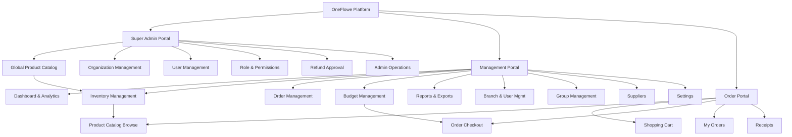
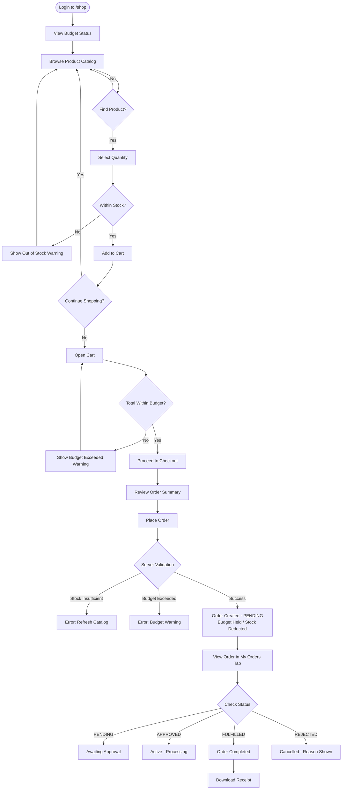
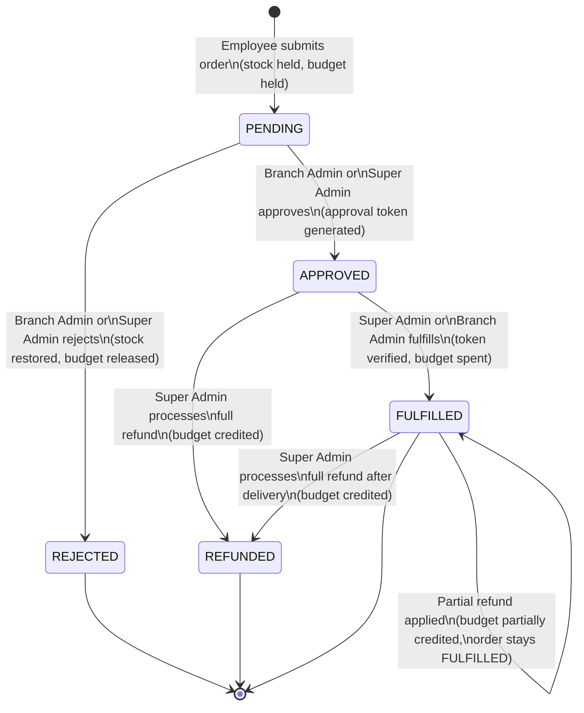
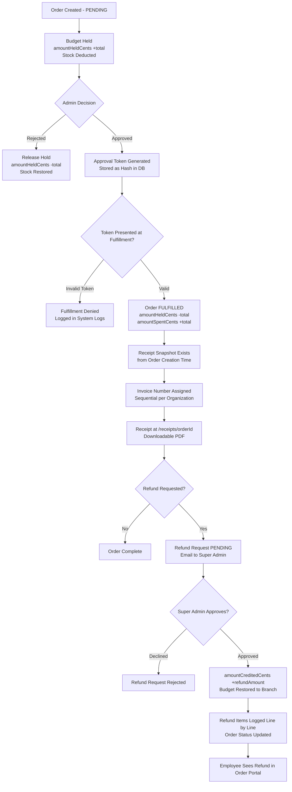
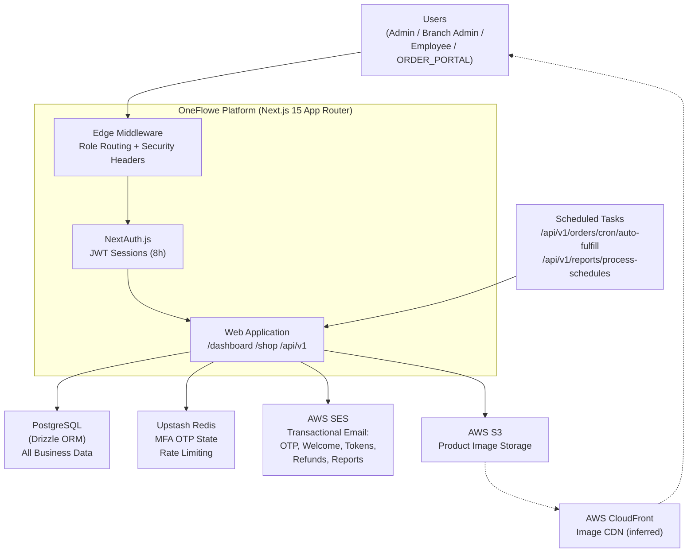

# OneFlowe — Product Diagrams

All diagrams use [Mermaid](https://mermaid.js.org/) syntax and can be rendered in GitHub, VSCode, or any Mermaid-compatible viewer.

---

## 1. Product Module Diagram

Shows the major modules and how they connect across all three portals.

---

## 2. User Role Flow Diagram

Shows which role accesses which part of the system.

```mermaid
graph TD
    Login["/login"] --> SA{Role?}

    SA -->|SUPER_ADMIN| SAP[Super Admin Portal]
    SA -->|HEAD_OFFICE| HOP[Head Office Portal]
    SA -->|BRANCH_ADMIN| BAP[Branch Admin Portal]
    SA -->|ORDER_PORTAL| OP[Order Portal /shop]
    SA -->|EMPLOYEE| OP

    SAP --> SAP1[Organizations]
    SAP --> SAP2[Global Inventory]
    SAP --> SAP3[All Users]
    SAP --> SAP4[All Orders - Approve/Fulfill]
    SAP --> SAP5[All Budgets]
    SAP --> SAP6[Refunds - Approve]
    SAP --> SAP7[All Reports]
    SAP --> SAP8[Roles & Permissions]

    HOP --> HOP1[Org Inventory - Assign]
    HOP --> HOP2[Branch Management]
    HOP --> HOP3[Org Users]
    HOP --> HOP4[Orders - View Only]
    HOP --> HOP5[Budgets - Allocate]
    HOP --> HOP6[Groups]
    HOP --> HOP7[Org Reports]

    BAP --> BAP1[Branch Inventory]
    BAP --> BAP2[Orders - Approve/Reject]
    BAP --> BAP3[Branch Budget - View]
    BAP --> BAP4[Employee Credentials]
    BAP --> BAP5[Refund Requests]
    BAP --> BAP6[Branch Reports]
    BAP --> BAP7[Suppliers]

    OP --> OP1[Browse Products]
    OP --> OP2[Cart & Checkout]
    OP --> OP3[My Orders]
    OP --> OP4[Receipts]
```

---

## 3. Customer / Employee Order Journey

The full path from login to product selection, cart, checkout, and order fulfillment.

---

## 4. Admin Management Flow

How each admin role manages the system.

```mermaid
flowchart TD
    A([Admin Login]) --> B{Admin Role}

    B -->|SUPER_ADMIN| SA[Super Admin Dashboard]
    B -->|HEAD_OFFICE| HO[Head Office Dashboard]
    B -->|BRANCH_ADMIN| BA[Branch Admin Dashboard]

    SA --> SA1[Manage Organizations]
    SA --> SA2[Manage Global Products]
    SA --> SA3[Assign Products to Orgs]
    SA --> SA4[Manage All Users]
    SA --> SA5[Review Refund Requests]
    SA --> SA6[Fulfill Orders with Token]
    SA --> SA7[View Platform-wide Reports]

    HO --> HO1[Assign Org Products to Branches]
    HO --> HO2[Manage Branches]
    HO --> HO3[Manage Org Users]
    HO --> HO4[Allocate Monthly Budgets]
    HO --> HO5[Create Branch Groups]
    HO --> HO6[View Org-level Reports]
    HO --> HO7[Schedule Automated Reports]

    BA --> BA1[Manage Branch Inventory Visibility]
    BA --> BA2[Approve / Reject Orders]
    BA --> BA3[View Branch Budget]
    BA --> BA4[Manage Employee Credentials]
    BA --> BA5[Submit Refund Requests]
    BA --> BA6[Manage Suppliers]
    BA --> BA7[View Branch Reports]
```

---

## 5. Order Lifecycle Diagram

All possible order status transitions.

---

## 6. Payment / Invoice / Receipt Flow

How budget, stock, invoice, and refund connect through the order lifecycle.

---

## 7. System Context Diagram

OneFlowe and all external systems it depends on.

